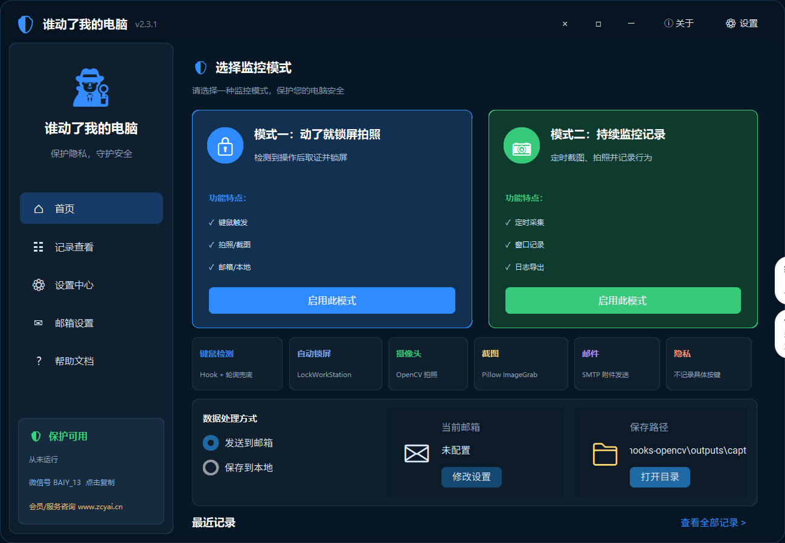
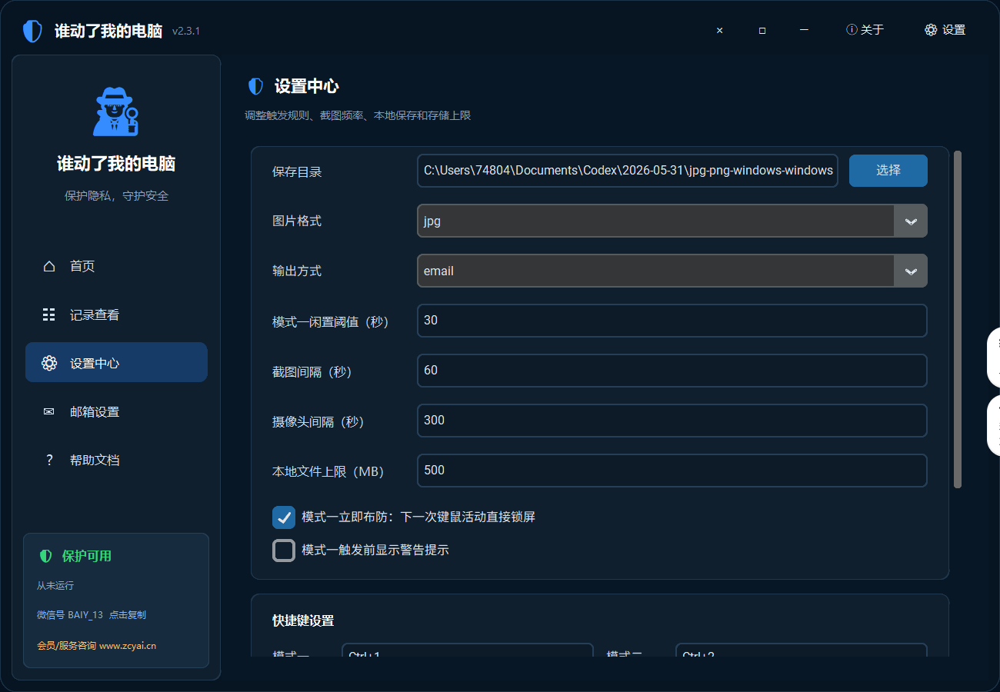
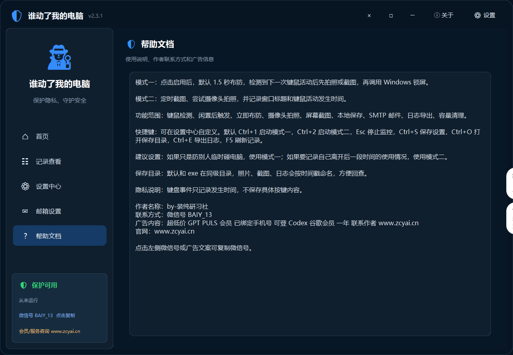

# 谁动了我的电脑

一个面向 Windows 的本机防误动与行为记录工具。  
提供两种可见、可配置的监控模式：

- 模式一：检测到键盘或鼠标活动后拍照/截图，并立即锁屏
- 模式二：按设定频率持续截图、尝试摄像头拍照，并记录窗口活动

作者：by-装纯研习社  
微信：`BAIY_13`  
官网：[dn.zcyai.cn](https://dn.zcyai.cn)

## 项目截图

### 首页



### 设置中心



### 帮助文档



## 功能概览

- 双模式监控：临时防碰电脑 / 持续记录使用行为
- 键鼠检测：检测键盘与鼠标活动
- 自动锁屏：调用 `LockWorkStation`
- 摄像头拍照：基于 OpenCV 尝试抓拍
- 屏幕截图：基于 Pillow `ImageGrab`
- 邮件发送：支持 SMTP 发送附件
- 本地保存：支持截图、照片、日志保存到本地目录
- 日志查看：最近记录、详情查看、打开文件、删除附件
- 快捷键：支持启动、停止、保存、导出、刷新等快捷操作
- 隐私保护：不记录具体按键内容，仅记录事件发生

## 适用场景

- 人离开电脑后，想在被碰动时立即锁屏并保留证据
- 想记录一段时间内的电脑使用情况
- 想把截图、照片、日志发到邮箱或留在本地

## 运行环境

- Windows 10 / 11
- Python 3.11+
- 摄像头可选

Python 依赖：

- `Pillow`
- `opencv-python`
- `customtkinter`

## 快速开始

在仓库根目录直接运行：

```powershell
.\run.ps1
```

或进入源码目录运行：

```powershell
cd .\outputs\who_touched_my_pc
.\run.ps1
```

## 打包 EXE

```powershell
.\build_exe.ps1
```

输出目录：

```text
outputs/who_touched_my_pc/dist/
```

## 配置说明

项目支持在界面中直接填写，或通过示例配置文件初始化：

```text
outputs/who_touched_my_pc/config.example.json
```

可配置项包括：

- 保存目录
- 图片格式
- 输出方式（邮箱 / 本地）
- 模式一闲置阈值
- 截图间隔
- 摄像头拍照间隔
- 本地文件上限
- SMTP 邮箱信息
- 自定义快捷键

## 目录结构

```text
.
├─ README.md
├─ LICENSE
├─ run.ps1
├─ build_exe.ps1
├─ docs/
│  └─ screenshots/
└─ outputs/
   └─ who_touched_my_pc/
      ├─ app.py
      ├─ requirements.txt
      ├─ config.example.json
      ├─ README.md
      ├─ run.ps1
      └─ build_exe.ps1
```

## Git 忽略策略

以下内容默认不进入仓库：

- 真实配置：`config.json`
- 运行日志：`logs/`
- 截图和照片：`captures/`
- 打包产物：`build/`、`dist/`、`*.exe`
- 本地缓存：`__pycache__/`

## 合规与使用边界

本项目仅适用于：

- 本人拥有的设备
- 已获得明确授权的设备

本项目不提供：

- 隐藏运行
- 绕过权限
- 未授权后台监控
- 键盘内容窃取

界面和功能均以可见、可配置、可停止为前提。

## 开源协议

MIT License，见 [LICENSE](LICENSE)。
